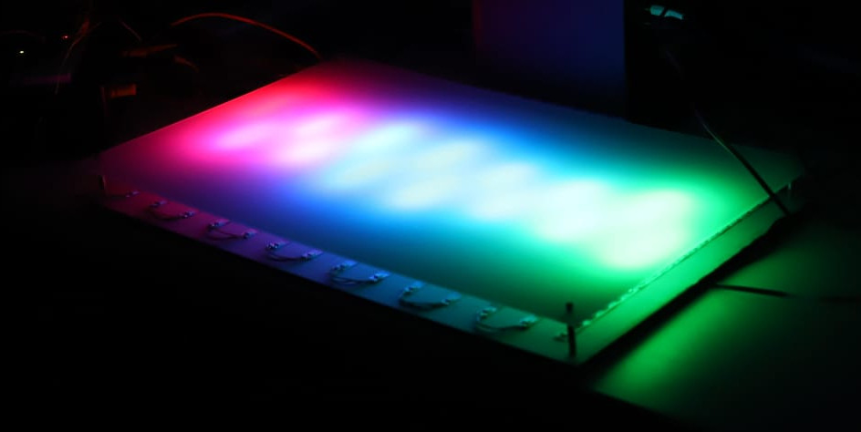

Digital Images
##############

This section deals with digital images and how computer can store their information.

    Spectrum project - `Arts et Sciences <http://artsetsciences.institutoptique.fr/>`_ - IOGS 2024. LEnsE & `Eric Michel <https://ericmichel.net/>`_.

.. toctree::
   :maxdepth: 1

	What is an image ?<images_digital>
	Image transformation<images_convol>