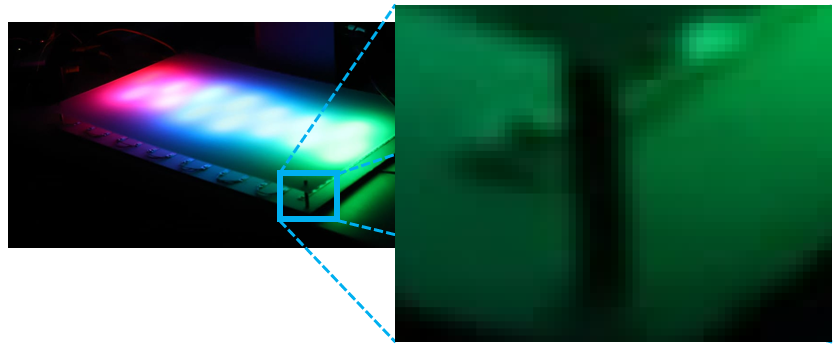
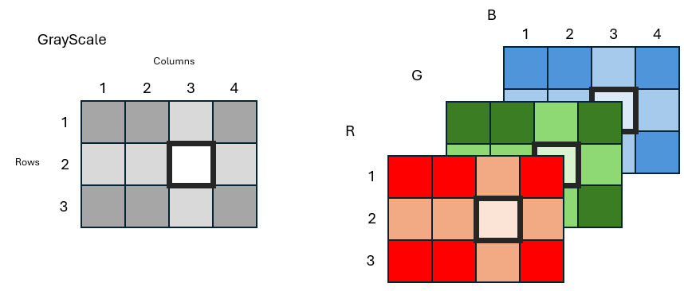

.. raw:: html

    

.. role:: darkorange
.. role:: red
.. role:: green
.. role:: blue

.. _digital-image:

What is an image ?
##################

An image is a **visual representation** or depiction of an object, scene, or concept. In the context of digital image processing, an image is typically **a two-dimensional array of pixels**. Each pixel represents a tiny unit of color or grayscale intensity.

.. figure:: ../_static/images/as_spectrum.jpg
    :align: center
    :scale: 50%

    Spectrum project - `Arts et Sciences <http://artsetsciences.institutoptique.fr/>`_ - IOGS 2024. LEnsE & `Eric Michel <https://ericmichel.net/>`_.

Raster vs vectorized images
***************************

There are **two main types** of digital images:

* **Raster images** (or pixels-based images): composed of a grid of pixels, where each pixel contains information about color and intensity. Raster images have a fixed resolution and can lose quality when scaled up. We can cite three subtypes of raster images:
    * **Grayscale Images**: Grayscale images consist of shades of gray, ranging from black to white, with each pixel representing a single intensity value.
    * **Color Images**: Color images consist of pixels with color information, typically represented using the RGB (Red, Green, Blue) color model.
    * **Binary Images**: Binary images contain only two distinct pixel values, typically representing foreground and background regions.
* **Vector Images**: composed of geometric shapes such as points, lines, and curves, which are defined by mathematical equations. These images can be scaled to any size without losing quality.

.. note::

    Throughout this tutorial, we will only deal with **raster images**.

What are the main characteristics of a raster image ?
*****************************************************

A raster image is composed of a **grid of pixels**, where each pixel contains information about color and intensity.

    Spectrum project with a zoom on a part of the image.

Each small square on the previous figure is a pixel.

The **main characteristics** of a digital image include:

* **Resolution**: it refers to the level of detail in an image and is typically measured in pixels. This resolution is based on the size of the 2D-array. An image has a **width** and an **height**.

* **Pixel Depth** or Bit Depth: it refers to the number of bits used to represent the color or intensity of each pixel in an image. Common pixel depths include 8-bit (256 levels), 16-bit (65,536 levels), and 24-bit (16.7 million colors).

* **Color Space**: it defines the range of colors that can be represented in an image. Common color spaces include RGB (Red, Green, Blue), CMYK (Cyan, Magenta, Yellow, Black), and Grayscale.

* **File Format**: It specifies how image data is stored and encoded in a digital file. Common image file formats include JPEG, PNG, GIF, TIFF, and BMP. Each format has its own compression method, metadata, and compatibility with different software and devices.

How to describe an image in process ?
*************************************

Digital images are stored in files. There are **different file formats** for storing images, such as JPEG, PNG, GIF, BMP, and TIFF, each with its own characteristics, compression methods, and capabilities.

In all cases, a **raster image** is considered by a computer as an **ordered collection of pixels**, where each pixel represents a tiny dot of color of the depicted scene. Each pixel contains information about its color and intensity, typically represented using combinations of red, green, and blue (RGB) values, but other color space exists.

When a computer displays an image, it reads the information stored for each pixel and renders them on the screen accordingly. This process involves converting the digital information into visual data that the human eye can perceive.

In an image processing procedure, one of the most frequently used methods is to store the pixels in **2- or 3-D arrays**, depending on the color space used and how the pixel information is stored (one number for the color or separated number for each component of the color).

    Array representation of a grayscale image (left side) or RGB color space image (right side).

Accessing a pixel information requires to know the coordinates of it, i.e. the **row** and the **column** numbers.

Grayscale mode
==============

In the grayscale mode, a pixel represents a **grayscale level** through a numerical value.

The most frequently used pixel depth for grayscale is **8-bits**, meaning that each grayscale value is coded on a **8-bits unsigned integer**. There are :math:`2^{8}` different levels.  A value of 0 corresponds to the black color, while the value 255 (:math:`2^{8} - 1`) corresponds to white color.

RGB mode
========

In the :abbr:`RGB (Red, Green, Blue)` mode, a pixel is a set of 3 numerical values corresponding respectively to a **color level** in the red, green and blue color.

The most frequently used pixel depth for RGB mode is **8-bits** for each color, meaning that each color value is coded on a **8-bits unsigned integer**. There are :math:`2^{8}` different levels for each color. A value of 0 corresponds to a lack of color, while the value 255 (:math:`2^{8} - 1`) corresponds to the maximum value of this color.

This representation of colors is often used. For example in HTML pages rendering (see `HTML Color Codes <https://htmlcolorcodes.com/>`_ ). The  :darkorange:`DarkOrange` color, for example, is a combination of :red:`R = 255`, :green:`G = 140` and :blue:`B = 0` .

