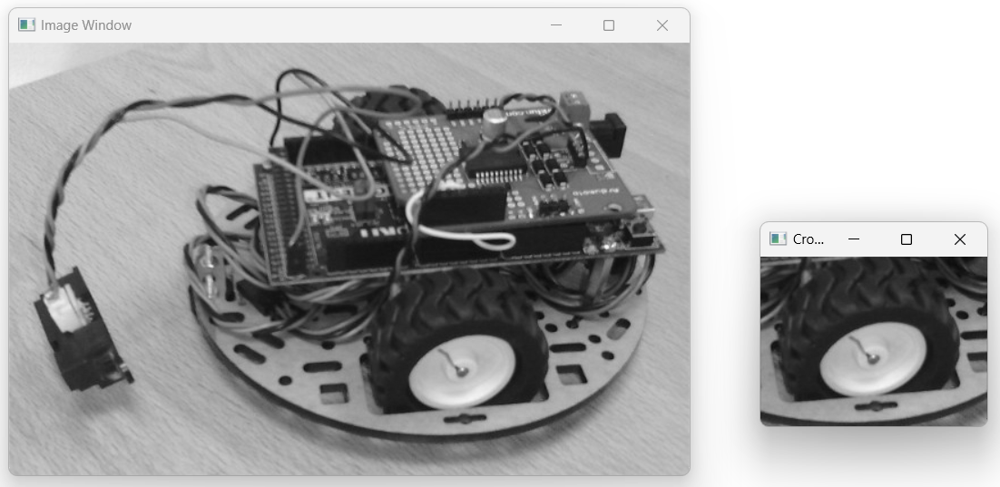

OpenCV: Basics
##############

A powerful set of tools for image processing

* :file:`07_opencv_first_try` : introducing OpenCV, open and display an image.
* :file:`08_opencv_mean_filters` : convolution with a specific kernel.
* :file:`09_opencv_erode_opening` : erosion, dilatation, opening and closing on image.

Install opencv
**************

Install for Python
==================

To install OpenCV for Python, you can use the package manager :code:`pip`.

.. code-block:: bash

	pip install opencv-python

Install for C++
===============

Soon...

Using Python 
************

.. note::

    The code of this example is in the :file:`\\progs\\Python\\07_opencv_first_try\\07_opencv_test.py` file of the repository.

    Examples of images are stored in :file:`\\_data\\` directory of the repository.

Import opencv
=============

To import OpenCV in your Python scripts, you can use this instruction:

.. code-block:: python

	import cv2
	
To display the version of OpenCV that is installed (and verify its good installation...), you can use this instruction: 

.. code-block:: python

	print(cv2.__version__)

Open an image
=============

The :code:`imread` function of OpenCV reads an image from a specified file path. A lot of different formats can be opened (JPG, PNG...).

.. code-block:: python

	image = cv2.imread('path/to/your/image.jpg')

Replace 'path/to/your/image.jpg' with the actual path to your image file.

>>> image = cv2.imread("../../_data/robot.pgm")

The data from the file are stored in a :code:`numpy.ndarray` object, as showed by the next instruction:

>>> print(type(image))
<class 'numpy.ndarray'>

You can also access to the size of the image (or shape) by the next instruction:

>>> print(image.shape)
(382, 600, 3)

The firt value is the height, the second one the width and the third one is the number of channels.

.. note::

	Even if the image is stored in a grayscale format, the :code:`imread` function of OpenCV create a 3 channels image (R, G, B). In the case of a grayscale format, the 3 channels are exactly the same.
	
You can also open an image in a GrayScale mode, with the following instruction:

.. code-block:: python

	image = cv2.imread('path/to/your/image.jpg', cv2.LOAD_IMAGE_GRAYSCALE)

In this case, the output array has only one channel.

Display an image
================

OpenCV uses different graphic backends to display images, depending on the operating system and how OpenCV was compiled. The most common graphic packages or libraries that OpenCV relies on to display images using the cv2.imshow() function include: GTK (GIMP Toolkit), Qt, Win32 API, Cocoa (on macOS).

To display an image, you can use the :code:`imshow` function of OpenCV as described below:

.. code-block:: python

	cv2.imshow('Image Window', image)
	
The first parameter is the name of the window that will display the image. The second parameter is the :code:`numpy.ndarray` containing the image.

.. warning::
	
	The :code:`imshow` function doesn't pause or block the execution of your script. To keep the window opened, a blocking function is required.
	
To maintain the display of the image, you can use the :code:`waitKey` function of OpenCV as mentionned below:

.. code-block:: python

	cv2.waitKey(0)  # 0 means wait indefinitely
	
To close the window, you need to click on the top-right cross of the window, or press any key of the keyboard.

At the end of your script, to be sure that each OpenCV window is closed, you can use this instruction:

.. code-block:: python
	
	cv2.destroyAllWindows()

Save an image
=============

It is also possible to save a :code:`numpy.ndarray` object (containing data of an image) in a specific file with the :code:`imwrite` function of OpenCV.

The next code, for example, permits to generate a random image (with Numpy random function) and to store it into a specific file.

.. code-block:: python

    # Generate a random image
    height, width, channels = 256, 512, 3
    # Generate random pixel values in the range [0, 255] for an RGB image
    random_image = np.random.randint(0, 256, (height, width, channels), dtype=np.uint8)

    # Save the image using OpenCV
    output_filename = 'random_image.png'
    cv2.imwrite(output_filename, random_image)

The :code:`imwrite` function needs two parameters: the path to the file to save the data and the :code:`numpy.ndarray` object containing the data.

Images as arrays
****************

As mentionned in the :ref:`digital-image` section, a digital raster image is a 2- or 3-D array, depending on the color space used and how the pixel information is stored. One of the most efficient method to store data from a digital image is to use :code:`numpy.ndarray`. OpenCV is based on this principle (as we could see in the previous part).

Access to a part of an image
============================

It is possible to access to a part of an image by using the properties of :code:`numpy.ndarray`. This process is called: **cropping an image**. This means extracting a rectangular portion from the original image.

To extract a part of an image from a first point of coordinates (x1, y1) to a second point of coordinates (x2, y2), you can follow this instruction:

.. code-block:: python

    image_crop = image[y1:y2,x1:x2,:]

To obtain the shape of the new cropped image, you can use:

.. code-block:: python

    print(image_crop.shape)
	
|

   Example of image cropping: on the left the original image, on the right the cropped image around the robot wheel.
   
For this example, we used the following code:

.. code-block:: python

    image = cv2.imread("../../_data/robot.pgm")
	image_crop = image[200:350,300:500,:]

Convert an image to grayscale format
====================================

Converting an image to grayscale is a common and useful step in image processing and computer vision to **simplify computation**. Grayscale images have only one channel (intensity), instead of three (RGB) in color images. Operations such as filtering, edge detection, and thresholding can be performed more quickly on grayscale images due to the reduced amount of data.

To convert an image to grayscale using OpenCV in Python, you can use the :code:`cvtColor` function. This function is designed to convert images between different color spaces, including converting a color image to grayscale:

.. code-block:: python

	grayscale_image = cv2.cvtColor(image, cv2.COLOR_BGR2GRAY)
	
If you check the shape of the resulting image, it has only one channel.

>>> print(grayscale_image.shape)
(382, 600)

Binarize an image
=================

Binarization is a fundamental image processing technique with various
applications across multiple fields: optical character recognition (OCR),
barcode and QR Code Detection, fingerprint recognition
art and Image Stylization...

Binarization simplifies image data by reducing it to its most basic form, making it easier for various algorithms to process, analyze, and extract meaningful information.

The :code:`threshold` function of OpenCV allows to perform a binarization of a grayscale image.

You can set a threshold value (e.g., 127) and a maximum value (e.g., 255).

.. code-block:: python

    retval, binary_image = cv2.threshold(grayscale_image, threshold,
                                         max_value, cv2.THRESH_BINARY)

This function returns two values:
 - *retval*: The threshold value used
 - *binary_image*: The binarized image

   Example of image binarization.

Besides *THRESH_BINARY*, OpenCV offers other thresholding methods:

- *THRESH_BINARY_INV*: Inverted binary thresholding
- *THRESH_TRUNC*: Truncates pixel values above the threshold
- *THRESH_TOZERO*: Sets pixels below the threshold to zero
- *THRESH_TOZERO_INV*: Sets pixels above the threshold to zero.

Histogram of an image
*********************

A histogram of an image provides a **visual summary of the tonal distribution** of the image, making it easier to analyze and adjust image properties like contrast and brightness.

.. figure:: ../_static/images/images_histogram.png
   :align: center

   Image (top) and its histogram (bottom).

.. note::

    The code of this example is in the :file:`\\progs\\Python\\07_opencv_first_try\\07_opencv_histo.py` file of the repository.

    Examples of images are stored in :file:`\\_data\\` directory of the repository.

Calculate the histogram
=======================

The :code:`calcHist` function of OpenCV allows to perform a binarization of a grayscale image.

.. code-block:: python
	
	cv2.calcHist([image], [chan], Mask, [bins_nb], [min, max])

It requires several parameters to process the histogram of an image:

- **image**: ndarray containing the data of one channel of an image
- **chan**: the channel for which the histogram is calculated. In the case of a grayscale image, there's only one channel (called 0).
- **mask**: to use a mask on the image to calculate the histogram only on a part of the image. If None, the histogram is calculated on the entire image.
- **bins_nb**: Number of bins. In a grayscale image (8-bits), pixel values range from 0 to 255, so there are 256 bins.
- **min, max**: The range of pixel values (from 0 to 256 - not included - in the case of a 8-bits grayscale image).

For a 8-bits grayscale image, you can use this instruction to calculate the histogram on the entire image:

.. code-block:: python
	
	histogram = cv2.calcHist([image], [0], None, [256], [0, 256])

The output is an **array** (numpy.ndarray) with a shape of (256, 1). Each column of this array contains the amount of pixels in the image corresponding to the gray value of its index. For example, The 10th box (histogram[10]) in the array corresponds to the number of occurrences of the grayscale value 10.

Display the histogram
=======================

To display the histogram, you can use the standard functions to display the value contained in a ndarray.

.. code-block:: python
	
	histogram = cv2.calcHist([image], [0], None, [256], [0, 256])
	
	plt.figure()
	plt.title("Grayscale Image Histogram")
	plt.xlabel("Pixel Intensity")
	plt.ylabel("Number of Pixels")
	plt.plot(histogram)
	plt.xlim([0, 256])  # Limits for the x-axis
	plt.show()

This set of instructions gives this result:	

   Histogram of the "robot" image (see the original image at the beggining of this section).

To obtain a histogram in a bar mode, you can use this set of instructions (see the resulting histogram at the beggining of this section):

.. code-block:: python
	
	histogram = cv2.calcHist([image], [0], None, [256], [0, 256])

	plt.figure()
	plt.title("Grayscale Image Histogram")
	plt.xlabel("Pixel Intensity")
	plt.ylabel("Number of Pixels")
	# Create a range of values (0 to 255) for the x-axis
	x = np.arange(256)
	# Plot the histogram as bars
	plt.bar(x, histogram[:,0], width=1, color='black') 
	plt.xlim([0, 256])  # Limits for the x-axis
	plt.show()
	
Enhance the image (contrast and brightness)
*******************************************

.. code-block:: python
	
	alpha = 1.5
	beta = 50
	image2 = cv2.convertScaleAbs(image, alpha=alpha, beta=beta) 