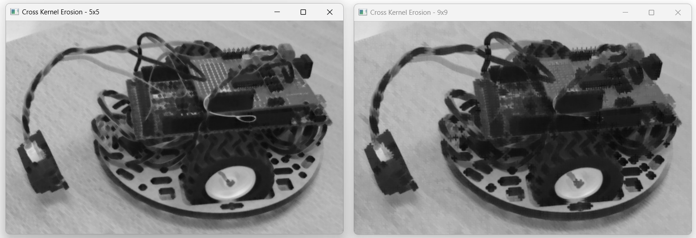
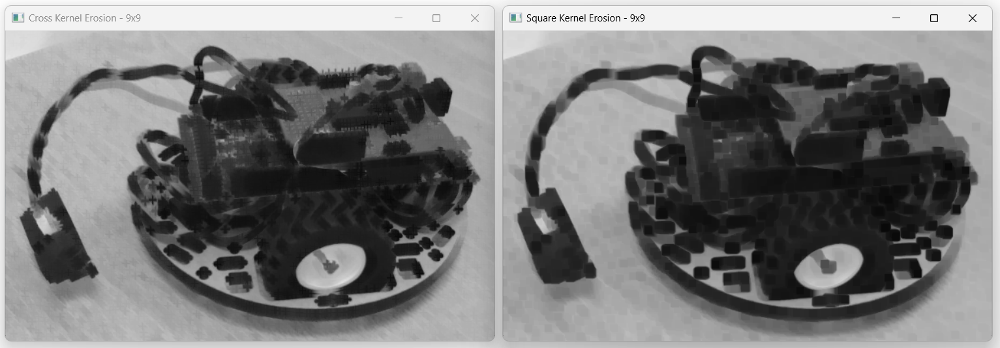

Erosion and dilation
####################

In **image processing**, erosion and dilation are fundamental morphological operations that modify the shape and
structure of objects in a binary image. Both operations use a kernel, also known as a structuring element, to define the neighborhood of pixels that influence the process. The choice of kernel affects how the erosion and dilation operations are applied to the image.

   Example of erosion operation on an image (Square kernel of size 9).

.. note::

    The code of this example is in the :file:`\\progs\\Python\\09_opencv_erode_opening\\09_opencv_erode.py` file of the repository.

    Examples of images are stored in :file:`\\_data\\` directory of the repository.

Kernels for erosion and dilation
********************************

The kernel used for these operations is typically a small, binary matrix, usually in the shape of a square,
rectangle, ellipse or cross.

Its size (e.g., 3x3, 5x5) determines the extent of the operation. Larger kernels result in more pronounced erosion or dilation effects.

Example of a square kernel (3x3):

.. math::

   \begin{bmatrix}
   1 & 1 & 1 \\
   1 & 1 & 1 \\
   1 & 1 & 1
   \end{bmatrix}

Example of a cross kernel (3x3):

.. math::

   \begin{bmatrix}
   0 & 1 & 0 \\
   1 & 1 & 1 \\
   0 & 1 & 0
   \end{bmatrix}

Kernels with OpenCV
===================

OpenCV provides the :code:`getStructuringElement` function to create these kernels and some predefined structure.

For example, to create a **cross kernel** of size *N* (where N is an odd integer), you can use the following instruction:

.. code-block:: python

    cross_kernel_N = cv2.getStructuringElement(cv2.MORPH_CROSS, (N, N))

To create a square kernel:

.. code-block:: python

    square_kernel_N = cv2.getStructuringElement(cv2.MORPH_RECT, (N, N))

Then, you can use :code:`erode` and :code:`dilate` functions to perform erosion and dilation, respectively.

Erosion Operation
*****************

Erosion removes pixels from the boundaries of objects in a binary image, effectively shrinking them. It is often used
to **eliminate small noise** and detach connected objects.

For each pixel in the image, the kernel is centered on the pixel, and the pixel is set to the minimum value covered by the kernel. If the kernel is entirely over foreground pixels (typically value 1), the central pixel remains as foreground. If even one pixel in the kernel's neighborhood is background (typically value 0), the central pixel becomes background.

Erosion with OpenCV
===================

The :code:`erode` function performs erosion on the given image using a specified kernel.

.. code-block:: python

    eroded_image_cross_9 = cv2.erode(grayscale_image, cross_kernel_9, iterations=1)

This function returns an array with the same shape as the initial image. You can then display the image with the standard :code:`imshow` function
of OpenCV.

   Example of erosion operation on an image (Cross kernel of size 5 on the left and 9 on the right).

   Comparison of erosion operation on an image (Cross kernel of size 9 on the left and square kernell of size 9 on the right).

Dilation Operation
******************

Dilation adds pixels to the boundaries of objects, effectively expanding them. It is used to **fill in small holes and gaps** and to connect adjacent objects.

For each pixel, the kernel is centered on the pixel, and the pixel is set to the maximum value covered by the kernel. If any part of the kernel overlaps a foreground pixel, the central pixel is set to foreground.