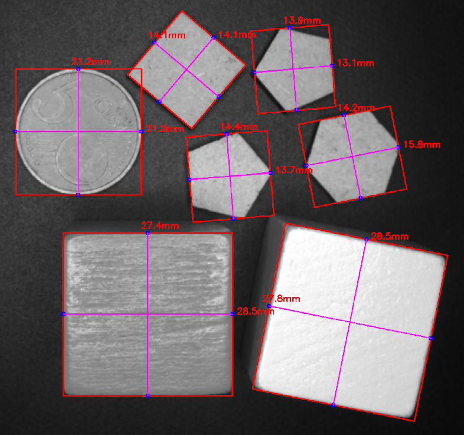

.. Image Processing documentation master file, created by
   sphinx-quickstart on Fri Dec 15 11:17:25 2023.
   You can adapt this file completely to your liking, but it should at least
   contain the root `toctree` directive.

Image Processing - Basics
#########################

.. caution::
   This application and its documentation website are still works in progress

**Image Processing** is a complete set of tutorials to learn the basics of **image processing** for machine vision systems. 

   Example of machine vision system to detect edges and shape of pieces.

	
Throughout these tutorials, we will use **Python** and **OpenCV**. Some examples in **C++** language will also be given.

.. note::

   To refresh your memory, discover these two sets of tutorials:

   * `Python for Science <https://iogs-lense-training.github.io/python-for-science/>`_.
   * `C++ language / Bascics <https://iogs-lense-training.github.io/cpp-basics-oop/>`_

The GitHub repository of this project : `Image Processing <https://github.com/IOGS-LEnsE-training/image-processing>`_

.. toctree::
   :maxdepth: 1
   :caption: Images

	Digital Images<contents/images>
	Python and images<contents/python>
	OpenCV basic operations<contents/opencv>

.. toctree::
   :maxdepth: 1
   :caption: Basic transforms
   
   	Blur filter<contents/opencv_blur>
	Erosion, dilation<contents/opencv_erod_dila>
	Opening, closing<contents/opencv_open_close>
   
	
.. toctree::
   :maxdepth: 1
   :caption: Edge and contours

Sharpening (Laplacian, Unsharp)

Edge detection (Sobel, Canny)

Median blur

Custom (cv2.filter2D)

Projects based on image processing
##################################

* `Machine Vision platform <https://iogs-lense-platforms.github.io/machine-vision>`_

About the LEnsE
###############

The **Experimental Teaching Laboratory** (LEnsE, for Laboratoire d’ENSeignement Expérimental) is a major structure of the Institut d’Optique engineering school. It offers remarkably strong training that contributes **25%** of the total curriculum. It is an impressive structure where students have access to a large diversity of material and human resources to be able to gain the skills to become excellent experimenters recognized in their field.

